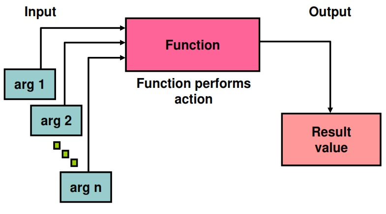
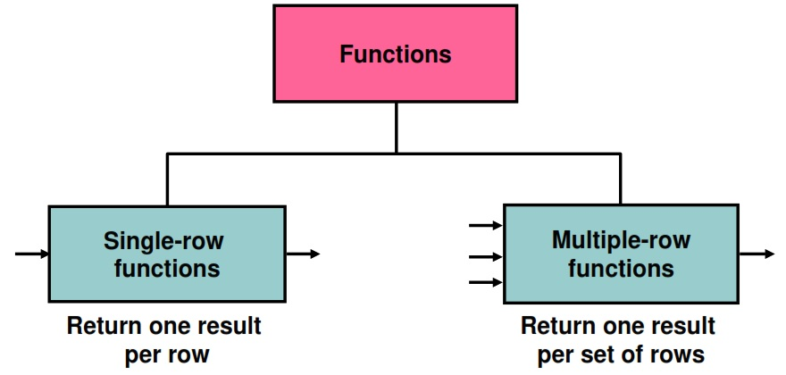
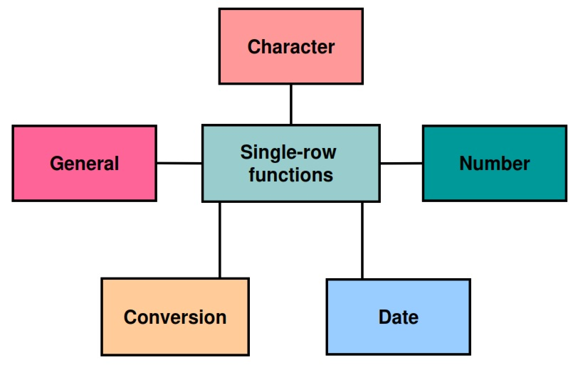
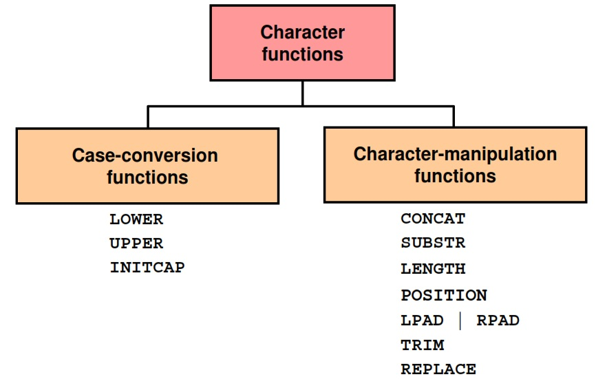

### 1. Retrieving Data Using the SQL SELECT Statement 
```sql
SELECT *|{[DISTINCT] column|expression [alias],...} 
FROM    table;
```
- `SELECT` identifies the columns to be displayed.
- `FROM` identifies the table containing those columns.

#### Selecting All Columns

```sql
SELECT *
FROM   departments;
```
<pre>
 department_id |   department_name    | manager_id | location_id
---------------+----------------------+------------+-------------
            10 | Administration       |        200 |        1700
            20 | Marketing            |        201 |        1800
            30 | Purchasing           |        114 |        1700
            40 | Human Resources      |        203 |        2400
            50 | Shipping             |        121 |        1500
            60 | IT                   |        103 |        1400
            70 | Public Relations     |        204 |        2700
            80 | Sales                |        145 |        2500
            90 | Executive            |        100 |        1700
           100 | Finance              |        108 |        1700
           110 | Accounting           |        205 |        1700
           120 | Treasury             |            |        1700
           130 | Corporate Tax        |            |        1700
           140 | Control And Credit   |            |        1700
           150 | Shareholder Services |            |        1700
           160 | Benefits             |            |        1700
           170 | Manufacturing        |            |        1700
           180 | Construction         |            |        1700
           190 | Contracting          |            |        1700
           200 | Operations           |            |        1700
           210 | IT Support           |            |        1700
           220 | NOC                  |            |        1700
           230 | IT Helpdesk          |            |        1700
           240 | Government Sales     |            |        1700
           250 | Retail Sales         |            |        1700
           260 | Recruiting           |            |        1700
           270 | Payroll              |            |        1700
(27 rows)
</pre>

```sql
SELECT department_id, location_id 
FROM   departments;
```

<pre>
 department_id | location_id
---------------+-------------
            10 |        1700
            20 |        1800
            30 |        1700
            40 |        2400
            50 |        1500
            60 |        1400
            70 |        2700
            80 |        2500
            90 |        1700
           100 |        1700
           110 |        1700
           120 |        1700
           130 |        1700
           140 |        1700
           150 |        1700
           160 |        1700
           170 |        1700
           180 |        1700
           190 |        1700
           200 |        1700
           210 |        1700
           220 |        1700
           230 |        1700
           240 |        1700
           250 |        1700
           260 |        1700
           270 |        1700
(27 rows)
</pre>

 #### Concatenation Operator
 A concatenation operator:
 - Links columns or character strings to other columns
 - Is represented by two vertical bars (||)
 - Creates a resultant column that is a character expression

```sql
SELECT last_name||job_id AS "Employees" 
FROM employees;
```

<pre>
      Employees
---------------------
 KingAD_PRES
 KochharAD_VP
 De HaanAD_VP
 HunoldIT_PROG
 ErnstIT_PROG
 AustinIT_PROG
 -- More  --
 (107 rows)
</pre>

#### Literal Character Strings
- A literal is a character, a number, or a date that is included in the SELECT statement.
- Date and character literal values must be enclosed within single quotation marks.
- Each character string is output once for each row returned.

#### Using Literal Character Strings

```sql
SELECT last_name ||' is a '||job_id AS "Employee Details"
FROM   employees;
```
<pre>
     Employee Details
---------------------------
 King is a AD_PRES
 Kochhar is a AD_VP
 De Haan is a AD_VP
 Hunold is a IT_PROG
 Ernst is a IT_PROG
 Austin is a IT_PROG
 Pataballa is a IT_PROG
 Lorentz is a IT_PROG
 -- More  --
 Whalen is a AD_ASST
 Hartstein is a MK_MAN
 Fay is a MK_REP
 Mavris is a HR_REP
 Baer is a PR_REP
 Higgins is a AC_MGR
 Gietz is a AC_ACCOUNT
(107 rows)
</pre>

#### Duplicate Rows
The default display of queries is all rows, including duplicate rows.

```sql
SELECT department_id 
FROM   employees;
```
<pre>
 department_id
---------------
            90
            90
            90
            60
            60
            60
-- More  --
</pre>

```sql
SELECT DISTINCT department_id 
FROM   employees;
```
<pre>
 department_id
---------------
            70
            80
            20
            10

            90
           100
           110
            30
            50
            40
            60
(12 rows)
</pre>


#### Displaying the Table Structure
- Use the `\d` command to display the structure of a table.
- Or, select the table in the Connections tree and use the Columns tab to view the table structure.

```sql
\d employees
```

<pre>
                                                 Table "hr.employees"
     Column     |            Type             | Collation | Nullable |                    Default
----------------+-----------------------------+-----------+----------+------------------------------------------------
 employee_id    | integer                     |           | not null | nextval('employees_employee_id_seq'::regclass)
 first_name     | character varying(20)       |           |          |
 last_name      | character varying(25)       |           | not null |
 email          | character varying(25)       |           | not null |
 phone_number   | character varying(20)       |           |          |
 hire_date      | timestamp without time zone |           | not null |
 job_id         | character varying(10)       |           | not null |
 salary         | numeric(8,2)                |           |          |
 commission_pct | numeric(2,2)                |           |          |
 manager_id     | integer                     |           |          |
 department_id  | integer                     |           |          |
Indexes:
    "employees_pkey" PRIMARY KEY, btree (employee_id)
    "emp_department_ix" btree (department_id)
    "emp_email_uk" UNIQUE CONSTRAINT, btree (email)
    "emp_job_ix" btree (job_id)
    "emp_manager_ix" btree (manager_id)
    "emp_name_ix" btree (last_name, first_name)
Check constraints:
    "emp_salary_min" CHECK (salary > 0::numeric)
Foreign-key constraints:
    "employees_department_id_fkey" FOREIGN KEY (department_id) REFERENCES departments(department_id)
    "employees_job_id_fkey" FOREIGN KEY (job_id) REFERENCES jobs(job_id)
    "employees_manager_id_fkey" FOREIGN KEY (manager_id) REFERENCES employees(employee_id)
Referenced by:
    TABLE "departments" CONSTRAINT "dept_mgr_fk" FOREIGN KEY (manager_id) REFERENCES employees(employee_id)
    TABLE "employees" CONSTRAINT "employees_manager_id_fkey" FOREIGN KEY (manager_id) REFERENCES employees(employee_id)
    TABLE "job_history" CONSTRAINT "job_history_employee_id_fkey" FOREIGN KEY (employee_id) REFERENCES employees(employee_id)
</pre>

### 2. Restricting and Sorting Data
#### Objectives
After completing this lesson, you should be able to do the following:
- Limit the rows that are retrieved by a query
- Sort the rows that are retrieved by a query
- Use ampersand substitution to restrict and sort output at run time

#### Limiting Rows Using a Selection

> retrieve all employees
<pre>
 employee_id |  last_name  |   job_id   | department_id
-------------+-------------+------------+---------------
         100 | King        | AD_PRES    |            90
         101 | Kochhar     | AD_VP      |            90
         102 | De Haan     | AD_VP      |            90
         103 | Hunold      | IT_PROG    |            60
         104 | Ernst       | IT_PROG    |            60
         105 | Austin      | IT_PROG    |            60
-- More  --
</pre>

> retrieve all employees in department 90

<pre>
 employee_id | last_name | job_id  | department_id
-------------+-----------+---------+---------------
         100 | King      | AD_PRES |            90
         101 | Kochhar   | AD_VP   |            90
         102 | De Haan   | AD_VP   |            90
(3 rows)
</pre>

#### Limiting the Rows That Are Selected
- Restrict the rows that are returned by using the `WHERE` clause:

```sh
SELECT *|{[DISTINCT] column|expression [alias],...} 
FROM   table
[WHERE condition(s)];
```
- The `WHERE` clause follows the `FROM` clause.

#### Using the `WHERE` Clause

```sh
SELECT employee_id, last_name, job_id, department_id 
FROM   employees
WHERE  department_id = 90 ;
```

#### Character Strings and Dates
- Character strings and date values are enclosed with single quotation marks.
- Character values are case-sensitive and date values are format-sensitive.
- The default date display format is `DD-MON-RR`.

```sh
SELECT last_name, job_id, department_id 
FROM   employees
WHERE  last_name = 'Whalen' ;
```

```sh
SELECT last_name 
FROM   employees
WHERE  hire_date = '17-FEB-96' ;
```

#### Comparison Operators
| **Operator**          | **Meaning**                                 |
| --------------------- | ------------------------------------------- |
| `=`                   | Equal to                                    |
| `>`                   | Greater than                                |
| `>=`                  | Greater than or equal to                    |
| `<`                   | Less than                                   |
| `<=`                  | Less than or equal to                       |
| `<>`                  | Not equal to                                |
| `BETWEEN ... AND ...` | Between two values (inclusive)              |
| `IN (set)`            | Match any value from a list                 |
| `LIKE`                | Match a character pattern (wildcards `% _`) |
| `IS NULL`             | Checks if a value is `NULL`                 |

#### Using Comparison Operators
```sh
SELECT last_name, salary 
FROM   employees
WHERE  salary <= 3000 ;
```

<pre>
  last_name  | salary
-------------+---------
 Baida       | 2900.00
 Tobias      | 2800.00
 Himuro      | 2600.00
 Colmenares  | 2500.00
 Mikkilineni | 2700.00
 Landry      | 2400.00
 Markle      | 2200.00
 Atkinson    | 2800.00
 Marlow      | 2500.00
 Olson       | 2100.00
 Rogers      | 2900.00
 Gee         | 2400.00
 Philtanker  | 2200.00
 Seo         | 2700.00
 Patel       | 2500.00
 Matos       | 2600.00
 Vargas      | 2500.00
 Sullivan    | 2500.00
 Geoni       | 2800.00
 Cabrio      | 3000.00
 Gates       | 2900.00
 Perkins     | 2500.00
 Jones       | 2800.00
 Feeney      | 3000.00
 OConnell    | 2600.00
 Grant       | 2600.00
(26 rows)
</pre>

#### Range Conditions Using the `BETWEEN` Operator

```sh
SELECT last_name, salary
FROM   employees
WHERE  salary BETWEEN 2500 AND 3500 ;
```

<pre>
  last_name  | salary
-------------+---------
 Khoo        | 3100.00
 Baida       | 2900.00
 Tobias      | 2800.00
 Himuro      | 2600.00
 Colmenares  | 2500.00
 Nayer       | 3200.00
 Mikkilineni | 2700.00
 Bissot      | 3300.00
 Atkinson    | 2800.00
 Marlow      | 2500.00
 Mallin      | 3300.00
 Rogers      | 2900.00
 Stiles      | 3200.00
 Seo         | 2700.00
 Patel       | 2500.00
 Rajs        | 3500.00
 Davies      | 3100.00
 Matos       | 2600.00
 Vargas      | 2500.00
 Taylor      | 3200.00
 Fleaur      | 3100.00
 Sullivan    | 2500.00
 Geoni       | 2800.00
 Dellinger   | 3400.00
 Cabrio      | 3000.00
 Gates       | 2900.00
 Perkins     | 2500.00
 McCain      | 3200.00
 Jones       | 2800.00
 Walsh       | 3100.00
 Feeney      | 3000.00
 OConnell    | 2600.00
 Grant       | 2600.00
(33 rows)
</pre>

#### Membership Condition Using the `IN` Operator
Use the `IN` operator to test for values in a list:

```sh
SELECT employee_id, last_name, salary, manager_id 
FROM   employees
WHERE  manager_id IN (100, 101, 201) ;
```

<pre>
 employee_id | last_name |  salary  | manager_id
-------------+-----------+----------+------------
         101 | Kochhar   | 17000.00 |        100
         102 | De Haan   | 17000.00 |        100
         108 | Greenberg | 12000.00 |        101
         114 | Raphaely  | 11000.00 |        100
         120 | Weiss     |  8000.00 |        100
         121 | Fripp     |  8200.00 |        100
         122 | Kaufling  |  7900.00 |        100
         123 | Vollman   |  6500.00 |        100
         124 | Mourgos   |  5800.00 |        100
         145 | Russell   | 14000.00 |        100
         146 | Partners  | 13500.00 |        100
         147 | Errazuriz | 12000.00 |        100
         148 | Cambrault | 11000.00 |        100
         149 | Zlotkey   | 10500.00 |        100
         200 | Whalen    |  4400.00 |        101
         201 | Hartstein | 13000.00 |        100
         202 | Fay       |  6000.00 |        201
         203 | Mavris    |  6500.00 |        101
         204 | Baer      | 10000.00 |        101
         205 | Higgins   | 12000.00 |        101
(20 rows)
</pre>

#### Pattern Matching Using the `LIKE` Operator
- Use the `LIKE` operator to perform wildcard searches of valid search string values.
- Search conditions can contain either literal characters or numbers:
    - `%` denotes zero or many characters. 
    - `_` denotes one character.

```sh
SELECT first_name
FROM employees
WHERE first_name LIKE 'S%' ;
```

<pre>
 first_name
------------
 Steven
 Shelli
 Sigal
 Shanta
 Steven
 Stephen
 Sarath
 Sundar
 Sundita
 Sarah
 Samuel
 Susan
 Shelley
(13 rows)
</pre>

#### Combining Wildcard Characters
- You can combine the two wildcard characters (`%, _`) with literal characters for pattern matching:

```sh
SELECT last_name
FROM   employees
WHERE  last_name LIKE '_o%' ;
```

<pre>
 last_name
------------
 Kochhar
 Lorentz
 Popp
 Tobias
 Colmenares
 Vollman
 Mourgos
 Rogers
 Doran
 Fox
 Johnson
 Jones
(12 rows)
</pre>

<<<<<<< HEAD
- You can use the 'ESCAPE' identifier to search for the actual `%` and `_` symbols.

#### Using the `NULL` Conditions

Test for nulls with the IS `NULL` operator.

```sh
SELECT last_name, manager_id 
FROM   employees
WHERE  manager_id IS NULL ;
```
<pre>
 last_name | manager_id
-----------+------------
 King      |
(1 row)
</pre>

#### Defining Conditions Using the Logical Operators

| **Operator** | **Meaning**                                                   |
|--------------|----------------------------------------------------------------|
| **AND**      | Returns `TRUE` if *both* component conditions are true       |
| **OR**       | Returns `TRUE` if *either* component condition is true       |
| **NOT**      | Returns `TRUE` if the condition is false                     |


#### Using the `AND` Operator

`AND` requires both the component conditions to be true:

```sh
SELECT employee_id, last_name, job_id, salary 
FROM   employees
WHERE  salary >= 10000
AND    job_id LIKE '%MAN%' ;
```
<pre>
 employee_id | last_name | job_id |  salary
-------------+-----------+--------+----------
         114 | Raphaely  | PU_MAN | 11000.00
         145 | Russell   | SA_MAN | 14000.00
         146 | Partners  | SA_MAN | 13500.00
         147 | Errazuriz | SA_MAN | 12000.00
         148 | Cambrault | SA_MAN | 11000.00
         149 | Zlotkey   | SA_MAN | 10500.00
         201 | Hartstein | MK_MAN | 13000.00
(7 rows)
</pre>

#### Using the `OR` Operator

`OR` requires either component condition to be true:

```sh
SELECT employee_id, last_name, job_id, salary 
FROM   employees
WHERE  salary >= 10000
OR     job_id LIKE '%MAN%' ;
```
<pre>
 employee_id | last_name | job_id  |  salary
-------------+-----------+---------+----------
         100 | King      | AD_PRES | 24000.00
         101 | Kochhar   | AD_VP   | 17000.00
         102 | De Haan   | AD_VP   | 17000.00
         108 | Greenberg | FI_MGR  | 12000.00
         114 | Raphaely  | PU_MAN  | 11000.00
         120 | Weiss     | ST_MAN  |  8000.00
         121 | Fripp     | ST_MAN  |  8200.00
         122 | Kaufling  | ST_MAN  |  7900.00
         123 | Vollman   | ST_MAN  |  6500.00
         124 | Mourgos   | ST_MAN  |  5800.00
         145 | Russell   | SA_MAN  | 14000.00
         146 | Partners  | SA_MAN  | 13500.00
         147 | Errazuriz | SA_MAN  | 12000.00
         148 | Cambrault | SA_MAN  | 11000.00
         149 | Zlotkey   | SA_MAN  | 10500.00
         150 | Tucker    | SA_REP  | 10000.00
         156 | King      | SA_REP  | 10000.00
         162 | Vishney   | SA_REP  | 10500.00
         168 | Ozer      | SA_REP  | 11500.00
         169 | Bloom     | SA_REP  | 10000.00
         174 | Abel      | SA_REP  | 11000.00
         201 | Hartstein | MK_MAN  | 13000.00
         204 | Baer      | PR_REP  | 10000.00
         205 | Higgins   | AC_MGR  | 12000.00
(24 rows)
</pre>

#### Using the `NOT` Operator

```sh
SELECT last_name, job_id 
FROM   employees
WHERE  job_id 
        NOT IN ('IT_PROG', 'ST_CLERK', 'SA_REP') ;
```

<pre>
 last_name  |   job_id
------------+------------
 King       | AD_PRES
 Kochhar    | AD_VP
 De Haan    | AD_VP
 Greenberg  | FI_MGR
 Faviet     | FI_ACCOUNT
 Chen       | FI_ACCOUNT
 Sciarra    | FI_ACCOUNT
 -- More  --
 Hartstein  | MK_MAN
 Fay        | MK_REP
 Mavris     | HR_REP
 Baer       | PR_REP
 Higgins    | AC_MGR
 Gietz      | AC_ACCOUNT
(52 rows)
</pre>

#### Rules of Precedence

Sure, Asim! Here's the table from the image you uploaded, neatly formatted for easier reading:

| **#** | **Operator**           | **Meaning**                                      |
|------:|------------------------|--------------------------------------------------|
| 1     | Arithmetic operators   | Perform basic math operations (e.g. +, –, ×, ÷)  |
| 2     | Concatenation operator | Combines strings of text                         |
| 3     | Comparison conditions  | Compare values (e.g. =, >, <)                    |
| 4     | IS [NOT] NULL, LIKE, [NOT] IN | Used to filter specific data conditions   |
| 5     | [NOT] BETWEEN          | Checks if a value is within a range              |
| 6     | Not equal to           | Determines inequality (e.g. != or <>)            |
| 7     | NOT logical condition  | Reverses a condition's logic                     |
| 8     | AND logical condition  | Ensures multiple conditions are true             |
| 9     | OR logical condition   | Checks if at least one condition is true         |

You can use parentheses to override rules of precedence.

```sh
SELECT last_name, job_id, salary 
FROM   employees
WHERE  job_id = 'SA_REP'
OR     job_id = 'AD_PRES'
AND    salary > 15000;
```

<pre>
 last_name  | job_id  |  salary
------------+---------+----------
 King       | AD_PRES | 24000.00
 Tucker     | SA_REP  | 10000.00
 Bernstein  | SA_REP  |  9500.00
 Hall       | SA_REP  |  9000.00
 Olsen      | SA_REP  |  8000.00
 Cambrault  | SA_REP  |  7500.00
 Tuvault    | SA_REP  |  7000.00
 King       | SA_REP  | 10000.00
 Sully      | SA_REP  |  9500.00
 McEwen     | SA_REP  |  9000.00
 Smith      | SA_REP  |  8000.00
 Doran      | SA_REP  |  7500.00
 Sewall     | SA_REP  |  7000.00
 Vishney    | SA_REP  | 10500.00
 Greene     | SA_REP  |  9500.00
 Marvins    | SA_REP  |  7200.00
 Lee        | SA_REP  |  6800.00
 Ande       | SA_REP  |  6400.00
 Banda      | SA_REP  |  6200.00
 Ozer       | SA_REP  | 11500.00
 Bloom      | SA_REP  | 10000.00
 Fox        | SA_REP  |  9600.00
 Smith      | SA_REP  |  7400.00
 Bates      | SA_REP  |  7300.00
 Kumar      | SA_REP  |  6100.00
 Abel       | SA_REP  | 11000.00
 Hutton     | SA_REP  |  8800.00
 Taylor     | SA_REP  |  8600.00
 Livingston | SA_REP  |  8400.00
 Grant      | SA_REP  |  7000.00
 Johnson    | SA_REP  |  6200.00
(31 rows)
</pre>

```sh
SELECT last_name, job_id, salary 
FROM   employees
WHERE  (job_id = 'SA_REP'
OR     job_id = 'AD_PRES')
AND    salary > 15000;
```
<pre>
 last_name | job_id  |  salary
-----------+---------+----------
 King      | AD_PRES | 24000.00
(1 row)
</pre>

#### Using the `ORDER BY` Clause

- Sort retrieved rows with the ORDER BY clause: 
    - `ASC`: Ascending order, default
    - `DESC`: Descending order
- The ORDER BY clause comes last in the SELECT statement:

```sh
SELECT   last_name, job_id, department_id, hire_date 
FROM     employees
ORDER BY hire_date ;
```

<pre>

  last_name  |   job_id   | department_id |      hire_date
-------------+------------+---------------+---------------------
 King        | AD_PRES    |            90 | 1987-06-17 00:00:00
 Whalen      | AD_ASST    |            10 | 1987-09-17 00:00:00
 Kochhar     | AD_VP      |            90 | 1989-09-21 00:00:00
 Hunold      | IT_PROG    |            60 | 1990-01-03 00:00:00
 Ernst       | IT_PROG    |            60 | 1991-05-21 00:00:00
 De Haan     | AD_VP      |            90 | 1993-01-13 00:00:00
 Higgins     | AC_MGR     |           110 | 1994-06-07 00:00:00
 Gietz       | AC_ACCOUNT |           110 | 1994-06-07 00:00:00
 Mavris      | HR_REP     |            40 | 1994-06-07 00:00:00
-- More  --
</pre>

#### Sorting
- Sorting in descending order:
```sh
SELECT   last_name, job_id, department_id, hire_date 
FROM     employees
ORDER BY hire_date DESC ;
```
- Sorting by column alias:
```sh
SELECT employee_id, last_name, salary*12 annsal 
FROM   employees
ORDER BY annsal ;
```
- Sorting by using the column’s numeric position:
```sh
SELECT   last_name, job_id, department_id, hire_date 
FROM     employees
ORDER BY 3;
```
- Sorting by multiple columns:
```sh
SELECT last_name, department_id, salary 
FROM   employees
ORDER BY department_id, salary DESC;
```
#### Summary
```sh
SELECT  *|{[DISTINCT] column|expression [alias],...} 
FROM    table
[WHERE  condition(s)]
[ORDER BY {column, expr, alias} [ASC|DESC]] ;
```
### 3 Using Single-Row Functions to Customize Output
#### Objectives
After completing this lesson, you should be able to do the following:
- Describe various types of functions available in SQL
- Use character, number, and date functions in SELECT statements

#### SQL Functions


#### Two Types of SQL Functions


#### Single-Row Functions
Single-row functions:
- Manipulate data items
- Accept arguments and return one value
- Act on each row that is returned
- Return one result per row
- May modify the data type
- Can be nested
- Accept arguments that can be a column or an expression

```sh
function_name [(arg1, arg2,...)]
```

#### Single-Row Functions


#### Character Functions


#### Case-Conversion Functions
These functions convert the case for character strings:

| **Function**               | **Result**       |
|----------------------------|------------------|
| `LOWER('SQL Course')`      | `sql course`     |
| `UPPER('SQL Course')`      | `SQL COURSE`     |
| `INITCAP('SQL Course')`    | `Sql Course`     |


- `LOWER` turns all characters to lowercase.
- `UPPER` converts all characters to uppercase.
- `INITCAP` capitalizes the first letter of each word.

#### Using Case-Conversion Functions
Display the employee number, name, and department number for employee Higgins:
```sh
SELECT employee_id, last_name, department_id 
FROM   employees
WHERE  last_name = 'higgins';
```

<pre>
 employee_id | last_name | department_id
-------------+-----------+---------------
(0 rows)
</pre>

```sh
SELECT employee_id, last_name, department_id 
FROM   employees
WHERE  LOWER(last_name) = 'higgins';
```


<pre>
 employee_id | last_name | department_id
-------------+-----------+---------------
         205 | Higgins   |           110
(1 row)
</pre>


#### Character-Manipulation Functions
These functions manipulate character strings:


| **Function**                                      | **Result**        |
|---------------------------------------------------|-------------------|
| `CONCAT('Hello', 'World')`                        | `HelloWorld`      |
| `SUBSTR('HelloWorld', 1, 5)`                      | `Hello`           |
| `LENGTH('HelloWorld')`                            | `10`              |
| `POSITION('W' IN 'HelloWorld')`                   | `6`               |
| `LPAD(salary, 10, '*')`                           | `*****24000`      |
| `RPAD(salary, 10, '*')`                           | `24000*****`      |
| `REPLACE('JACK and JUE', 'J', 'BL')`              | `BLACK and BLUE`  |
| `TRIM('H' FROM 'HelloWorld')`                     | `elloWorld`       |

These functions are essential in SQL when manipulating text and numbers:
- `CONCAT` joins strings together.
- `SUBSTR` extracts a portion of the text.
- `LENGTH` gets the character count.
- `POSITION` finds where a character appears.
- `LPAD/RPAD` pads text with extra characters.
- `REPLACE` swaps one string for another.
- `TRIM` removes specific characters from the ends.

#### Number Functions
- `ROUND`: Rounds value to a specified decimal
- `TRUNC`: Truncates value to a specified decimal 
- `MOD`: Returns remainder of division


| **Function**             | **Result** |
|--------------------------|------------|
| `ROUND(45.926, 2)`       | `45.93`    |
| `TRUNC(45.926, 2)`       | `45.92`    |
| `MOD(1600, 300)`         | `100`      |

These SQL functions deal with numeric manipulation:
- `ROUND` adjusts numbers based on rounding rules.
- `TRUNC` cuts off digits without rounding.
- `MOD` gives the remainder of a division.

#### Using the `ROUND` Function
```sh
SELECT ROUND(45.923,2), ROUND(45.923,0), ROUND(45.923,-1);
```
<pre>
 round | round | round
-------+-------+-------
 45.92 |    46 |    50
(1 row)
</pre>

#### Using the `TRUNC` Function

```sh
SELECT TRUNC(45.923,2), TRUNC(45.923), TRUNC(45.923,-1);
```
<pre>
 trunc | trunc | trunc
-------+-------+-------
 45.92 |    45 |    40
(1 row)
</pre>

#### Using the `MOD` Function
For all employees with the job title of Sales Representative, calculate the remainder of the salary after it is divided by 5,000.

```sh
SELECT last_name, salary, MOD(salary, 5000) 
FROM   employees
WHERE  job_id = 'SA_REP';
```
<pre>
 last_name  |  salary  |   mod
------------+----------+---------
 Tucker     | 10000.00 |    0.00
 Bernstein  |  9500.00 | 4500.00
 Hall       |  9000.00 | 4000.00
 Olsen      |  8000.00 | 3000.00
 Cambrault  |  7500.00 | 2500.00
 Tuvault    |  7000.00 | 2000.00
 King       | 10000.00 |    0.00
 Sully      |  9500.00 | 4500.00
 McEwen     |  9000.00 | 4000.00
 Smith      |  8000.00 | 3000.00
 Doran      |  7500.00 | 2500.00
 Sewall     |  7000.00 | 2000.00
 Vishney    | 10500.00 |  500.00
 Greene     |  9500.00 | 4500.00
 Marvins    |  7200.00 | 2200.00
 Lee        |  6800.00 | 1800.00
 Ande       |  6400.00 | 1400.00
 Banda      |  6200.00 | 1200.00
 Ozer       | 11500.00 | 1500.00
 Bloom      | 10000.00 |    0.00
 Fox        |  9600.00 | 4600.00
 Smith      |  7400.00 | 2400.00
 Bates      |  7300.00 | 2300.00
 Kumar      |  6100.00 | 1100.00
 Abel       | 11000.00 | 1000.00
 Hutton     |  8800.00 | 3800.00
 Taylor     |  8600.00 | 3600.00
 Livingston |  8400.00 | 3400.00
 Grant      |  7000.00 | 2000.00
 Johnson    |  6200.00 | 1200.00
(30 rows)
</pre>

#### Working with Dates
- The Postgres database stores dates in an internal numeric format: century, year, month, day, hours, minutes, and seconds.
- The default date display format is `DD-MON-RR`.
    - Enables you to store 21st-century dates in the 20th century by specifying only the last two digits of the year
    - Enables you to store 20th-century dates in the 21st century in the same way

```sh
SELECT last_name, hire_date 
FROM   employees
WHERE  hire_date < '01-FEB-88';
```
<pre>
 last_name |      hire_date
-----------+---------------------
 King      | 1987-06-17 00:00:00
 Whalen    | 1987-09-17 00:00:00
(2 rows)
</pre>


[def]: )
